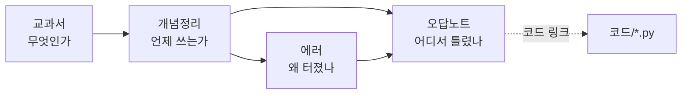

# codingtext_study

코딩테스트 공부 저장소. **옵시디언 볼트**로 열어서 쓰고, GitHub에는 백업 겸 기록으로 올린다.

이 저장소 폴더를 옵시디언에서 `폴더를 볼트로 열기` 하면 그대로 볼트가 된다.

## 설계

문서를 네 층으로 나눈다. **한 노트가 한 가지 질문에만 답하게** 하는 게 핵심이다.

| 폴더 | 답하는 질문 | 성격 |
|---|---|---|
| `교과서/` | 이 개념이 **무엇**인가 | 지식 — 문제와 무관하게 성립 |
| `개념정리/` | **언제** 이 개념을 쓰는가 | 판단 — 선택 기준과 트레이드오프 |
| `오답노트/` | **어디서** 틀렸는가 | 경험 — 내 사고의 오류 기록 |
| `에러/` | **왜** 터졌는가 | 증상 — 에러 메시지에서 역추적 |
| `코드/` | 실행 가능한 풀이 | `.py` — 테스트 포함 |

**각 폴더의 `README.md` 에 그 폴더의 형식 템플릿이 들어 있다.** 새 노트를 쓸 때 거기서 복사해 시작한다.

> [!important] 코드 파일은 기록, 노트는 회고
> `코드/*.py` 에는 **실제로 제출해서 통과시킨 코드만** 담백하게 둔다. 주석 없이.
> 유일한 예외는 파일 맨 아래 테스트 코드 — 여기는 주석을 써도 된다.
>
> 설명, 대안 풀이, "이렇게 했으면 어땠을까" 는 전부 **오답노트**에 적는다.
> 같은 코드가 두 군데 있으면 반드시 어긋나고, `.py` 에 주석으로 회고를 적으면 노트를 안 보게 된다.

### 연결 방향

- **교과서 → 개념정리**: 개념을 배우면, 그 개념을 언제 꺼내 쓸지 판단 노트에 연결한다
- **개념정리 → 오답노트**: 문제를 틀리면, 어떤 판단을 놓쳤는지 개념정리로 거슬러 올라간다
- **에러 → 오답노트**: 같은 에러가 여러 문제에서 반복되면 에러 노트가 허브가 된다
- 링크는 옵시디언 **위키링크** `[[노트 이름]]` 을 쓴다. 코드 파일만 상대 경로 링크

> [!note] 왜 위키링크인가
> 옵시디언의 그래프 뷰·백링크·자동완성이 전부 위키링크 기준으로 동작한다.
> 대신 GitHub 웹에서는 `[[...]]` 가 클릭되지 않고 글자 그대로 보인다. **읽는 건 옵시디언, 보관은 GitHub** 이라는 역할 분담을 전제로 한 선택이다.

## 현재 상태

- [x] `개념정리/` — 앞에서 빼야 할 때, 두 뭉치 순서대로 꺼내기
- [x] `오답노트/` — 카드뭉치 (프로그래머스 159994)
- [x] `에러/` — IndexError: list index out of range
- [x] `코드/` — 카드뭉치.py (세 가지 풀이 + 테스트)
- [ ] `교과서/` — **작성 예정**. 시간복잡도 / 리스트 / deque / 연결 리스트 / 투 포인터를 한 번에 쓴다. 목록과 규칙은 [교과서/README.md](교과서/README.md)

다른 노트에서 교과서 노트를 **미리 위키링크로 걸어 두었다.** 옵시디언 그래프 뷰에서 속이 빈 회색 점으로 보이는 것들이 아직 안 쓴 노트이고, 그 이름으로 파일을 만들면 링크가 자동으로 이어진다. 즉 **그래프의 빈 점 = 남은 할 일**이다.

## 쓰는 순서

1. 문제를 틀린다
2. `오답노트/README.md` 의 형식 템플릿을 복사해 `오답노트/문제이름.md` 를 만든다
3. **"왜 그렇게 생각했나"** 를 먼저 채운다 — 정답 코드보다 이게 자산이다
4. 에러가 났으면 `에러/` 에 해당 노트가 있는지 보고, 없으면 만들고, 있으면 사례를 덧붙인다
5. 판단을 놓친 거라면 `개념정리/` 에 기준을 적는다. 개념 자체가 부족했으면 `교과서/` 에 노트를 만든다
6. 코드는 `코드/문제이름.py` 로 저장. `if __name__ == "__main__":` 아래 테스트를 붙여 `python 코드/문제이름.py` 로 바로 검증

## 옵시디언 설정

`설정 → 파일 및 링크`

- **새 링크 형식**: 짧은 링크 이름 (폴더를 옮겨도 링크가 안 깨진다)
- **위키링크 사용**: 켬

### 필수 플러그인: VSCode Editor

`설정 → 커뮤니티 플러그인 → 탐색` 에서 **VSCode Editor** 설치 후 활성화.

`.py` 파일을 옵시디언 탭 안에서 VS Code 편집기(Monaco)로 열어준다. 이게 없으면 옵시디언이 `.py` 를 윈도우 기본 프로그램에 넘겨버려서 **파일이 그냥 실행된다.**

- `py` 는 기본 지원 확장자에 포함되어 있다
- 인터넷 연결 없이 동작한다 (같은 계열의 `Code Files` 플러그인은 외부 서버에서 편집기를 불러오므로 오프라인에서 안 됨)
- 설치 후에도 탐색기에 `.py` 가 안 보이면 `설정 → 파일 및 링크 → 모든 파일 확장자 감지` 를 켠다

### 선택 플러그인

| 플러그인 | 왜 |
|---|---|
| **Obsidian Git** | 저장할 때마다 자동 커밋·푸시. GitHub 동기화가 가장 편해진다 |
| **Dataview** | frontmatter `tags` 로 "Lv.2 오답노트만 모아보기" 같은 목록 자동 생성 |
| **Templater** | 폴더 README의 템플릿을 단축키로 삽입, 날짜 자동 입력 |
